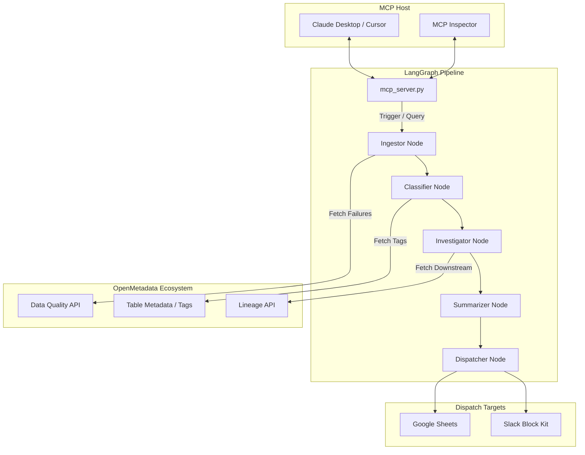

# DQ-Agent: Autonomous Data Quality Agent


DQ-Agent is an autonomous LangGraph state machine that connects directly to OpenMetadata via the Model Context Protocol (MCP). It continuously monitors data quality execution streams, leverages OpenMetadata's lineage graph to calculate downstream blast radius, and uses advanced LLM reasoning to identify root causes and assign compliance-driven severity scores.

---

## Technical Architecture

DQ-Agent bridges the gap between infrastructure state (OpenMetadata) and natural language interfaces (Claude Desktop / Cursor) by operating as a native MCP server.



---

## Core Capabilities

1. **Model Context Protocol (MCP) Integration**: Acts as a hostable MCP tool server. Exposes capabilities (`get_table_health`, `list_recent_failures`, `trigger_weekly_report`) directly to AI environments like Claude and Cursor.
2. **Deep OpenMetadata Lineage Tracing**: Does not just report failures; actively queries the `/api/v1/lineage/table/name/{fqn}` endpoint to discover downstream assets (Dashboards, ML Models) impacted by upstream data issues.
3. **Governance and PII Awareness**: Queries table-level tags (`/api/v1/tables/name/{fqn}`). Enforces strict compliance heuristics: if a failing table carries `PII`, `Tier1`, or `Sensitive` tags, the anomaly is immediately escalated to a P1 Critical incident.
4. **LangGraph State Orchestration**: Utilizes a directed acyclic graph for pipeline execution, enabling robust context passing, state memory, and LLM-driven anomaly classification.
5. **Rich Output Dispatching**: Leverages Google Sheets API `batchUpdate` for dynamically styled dashboard generation and Slack SDK for Block Kit severity alerts.

---

## Setup & Installation

### 1. OpenMetadata Instance Setup
To run the DQ-Agent, you require an active OpenMetadata instance.
```bash
# Download the Docker Compose file
curl -sL https://github.com/open-metadata/OpenMetadata/releases/download/1.3.1-release/docker-compose.yml -o docker-compose.yml

# Spin up the infrastructure
docker compose up -d

# The UI will be available at http://localhost:8585 (admin:admin)
```

### 2. DQ-Agent Environment Configuration
```bash
# Clone the repository
git clone https://github.com/Photon079/Openmetaadatahack.git
cd Openmetaadatahack

# Create a virtual environment and activate it
python -m venv venv
source venv/bin/activate

# Install requirements
pip install -r requirements.txt
```

Create a `.env` file in the project root with the following variables:
```properties
OM_BASE_URL=http://localhost:8585
OM_USERNAME=admin
OM_PASSWORD=admin

GEMINI_API_KEY=your_gemini_key

# Optional Outputs
SLACK_BOT_TOKEN=your_slack_bot_token
SLACK_CHANNEL=#data-alerts
SHEET_ID=your_google_sheet_id
```
Ensure your `gcp-sa.json` (Google Cloud Service Account file) is placed in the project root if you intend to use Google Sheets dispatching.

### 3. Model Context Protocol (MCP) Setup

#### Option A: Cursor IDE (Recommended for Developers)
1. Open Cursor Settings -> **Features** -> **MCP**.
2. Click **+ Add New MCP Server**.
3. Name: `DQ-Agent`
4. Type: `command`
5. Command: `/absolute/path/to/venv/bin/python /absolute/path/to/mcp_server.py`
6. Open the Cursor Chat window and prompt the AI (e.g., "Check table health for dim_users").

#### Option B: Claude Desktop
Add the following to your `claude_desktop_config.json`:
```json
{
  "mcpServers": {
    "DQ-Agent": {
      "command": "/absolute/path/to/venv/bin/python",
      "args": [
        "/absolute/path/to/mcp_server.py"
      ],
      "env": {
        "GEMINI_API_KEY": "your_key_here",
        "SLACK_BOT_TOKEN": "your_token",
        "SHEET_ID": "your_id"
      }
    }
  }
}
```

#### Option C: CLI Inspector (For Testing)
```bash
npx -y @modelcontextprotocol/inspector python mcp_server.py
```

### 4. Running the Agent Manually (CLI)
If you don't want to use MCP, you can trigger the agent manually from your terminal to generate reports.

```bash
# Run a full check against your live OpenMetadata instance
python agent.py

# Run an offline test with mock data (no live OM needed)
python agent.py --mock

# Filter the report for a specific domain (e.g., "finance")
python agent.py --domain finance

# Disable external dispatching (Slack/Sheets)
python agent.py --no-slack --no-sheets
```

### 5. Testing & Verification
Once installed, you can verify the system is working properly without needing to spin up a live OpenMetadata instance.

Run the mock test suite:
```bash
python agent.py --mock --no-slack --no-sheets
```

**Expected Output:**
You should see the LangGraph workflow execute in your terminal, culminating in a `Final State` printout showing the AI's hypothesized root cause for the mocked failure events, demonstrating that the LLM and Graph logic are functioning correctly.

---

## License & Ownership
All architectural patterns and code are provided as-is under the MIT License.
